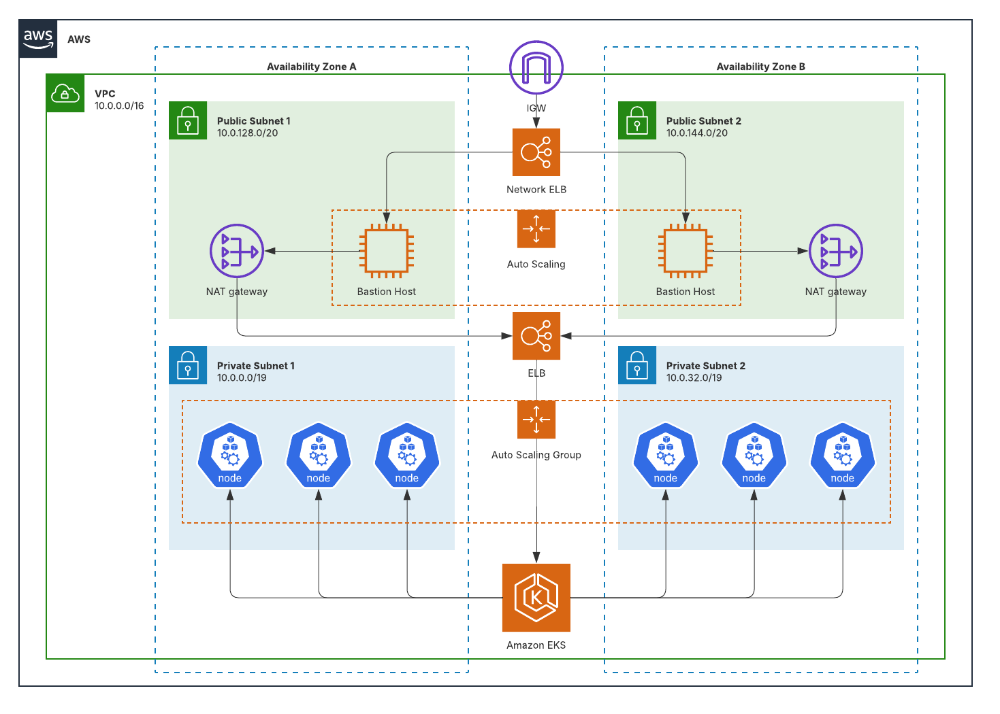

# AWS EKS Reference Architecture (Terraform 1.5, Module-based)

[](https://doi.org/10.5281/zenodo.16883393)

This repository contains an opinionated, production-ready **Amazon EKS** architecture built with **Terraform 1.5** using a **module-based** layout.  
It creates a highly-available Kubernetes control plane and worker nodes across **two Availability Zones**, with segmented **public** and **private** subnets, **NAT Gateways**, **bastion hosts**, and **Elastic Load Balancing (NLB/ALB)** for north–south traffic.

> **Goal:** Provide a clean, extensible baseline that teams can fork, customize, and contribute to via Pull Requests—covering networking, security, cluster add-ons, and pod-IP scalability (no “IP limit” surprises).

---

## 📐 Architecture Overview



**Layers & components**

- **VPC**
  - /16 (configurable) CIDR with **2× AZs**
  - **Public subnets** (ELB/NLB, NAT GW, bastion)
  - **Private subnets** (EKS worker nodes, app workloads)
  - **Route tables** for public/private paths
  - **Internet Gateway** and **NAT Gateways** (1 per AZ)

- **Access & Security**
  - **Direct EKS API access** with configurable public/private endpoint access
  - **Security Groups** for control plane ↔ nodes and load balancers
  - **IRSA** (IAM Roles for Service Accounts) for add-ons
  - **KMS** (optional) for secret encryption at rest

- **EKS**
  - Managed control plane (version pinned)
  - **Managed Node Groups** across both AZs (**AL2023/Bottlerocket for 1.33+**)
  - Core **add-ons**: VPC CNI, CoreDNS, kube-proxy
  - Optional add-ons: Cluster Autoscaler or Karpenter, EBS/EFS CSI, Metrics Server, Ingress Controller

- **Load Balancing**
  - **NLB/ALB** in public subnets for ingress
  - **NodePort**/Target Groups to workloads in private subnets

---

## 🚀 What This Stack Intends To Do

- Stand up a **secure, HA EKS cluster** with sane defaults for production.
- Provide a **module-based Terraform** layout that’s easy to read and extend.
- **Avoid pod-IP exhaustion** with two supported strategies:
  1) **AWS VPC CNI custom networking + prefix delegation** (pods draw addresses from pod-only subnets; much higher pod density per node).  
  2) **Overlay CNI** (e.g., Cilium with cluster-pool IPAM) so pods don’t consume VPC IPs at all.  
   _Defaults target strategy (1)._
- Make contributions easy (fork, branch, PR) for **features**, **bug fixes**, and **quick fixes**.

---

## 📦 Versions (Pinned & Tested)

| Component              | Version / Constraint                              | Notes |
|---|---|---|
| **Terraform**          | **1.5.x** (required)                              | Repo created/tested on 1.5; lockfile recommended to commit. |
| **AWS Provider**       | `~> 5.0`                                          | Pin major to 5; supports latest EKS & VPC resources. |
| **Kubernetes Provider**| `~> 2.0`                                          | For cluster resources after EKS is up. |
| **Helm Provider**      | `~> 2.0`                                          | For add-ons installed via Helm. |
| **EKS (Kubernetes)**   | **1.33** (default)                                | For 1.33+, use AL2023/Bottlerocket node AMIs. |
| **Core Add-ons**       | VPC CNI / CoreDNS / kube-proxy pinned via vars    | Exact versions set via variables; update safely with plan/apply. |

> If you bump EKS or add-on versions, please update the table above and the variables in `/env/…/` and submit a PR.

---

## 🧱 Repository Layout (Module-based)

```
.
├── modules/
│   ├── network/          # VPC, subnets, IGW, NAT, route tables
│   ├── security/         # IAM, IRSA, KMS (optional), security groups
│   ├── eks/              # EKS cluster, node groups, auth config
│   └── addons/           # VPC CNI, CoreDNS, kube-proxy, CSI, autoscaling, ingress
├── env/
│   ├── dev/
│   │   ├── main.tf
│   │   ├── versions.tf   # Terraform + provider constraints
│   │   ├── providers.tf
│   │   ├── variables.tf
│   │   ├── terraform.tfvars
│   │   └── backend.tf (optional pattern)
│   └── prod/
│       └── ...
├── docs/
│   └── diagrams/
│       └── aws-eks-architecture.png
├── Makefile              # helper targets (fmt, validate, plan, apply, destroy)
├── .pre-commit-config.yaml
├── .gitignore
├── README.md
└── LICENSE
```

---

## 🔧 Key Implementation Notes

### Pod IP Strategy (no "IP limits")
**Current Configuration:** AWS VPC CNI with **prefix delegation only**:
- **Prefix delegation**: Enabled by default - assigns IP prefixes to ENIs, dramatically increasing pod density (110+ pods per t3.small node)
- **Custom networking**: Disabled by default for stability and simplicity
- **WARM_PREFIX_TARGET**: Set to 1 for optimal IP utilization
- **Pod density**: Achieves high pod counts without custom networking complexity

**Alternative modes available via variables:**
- **Custom networking + prefix delegation**: For even higher density with dedicated pod subnets
- **Cilium overlay**: Pod IPs from cluster CIDR (e.g., `10.244.0.0/16`) with SNAT via nodes

### High Availability
- 2× AZ minimum, subnets split per AZ.
- 1× NAT Gateway per AZ (failover friendly).
- Managed Node Groups across AZs.

### Security
- **Private nodes** (no public IPs) behind NAT Gateway
- **EKS API endpoint** access controlled via Security Groups and CIDRS
- **IRSA** for least-privileged access to AWS services
- Optional **KMS** envelope encryption for secrets

---

## ✅ Prerequisites

- Terraform **1.5.x**
- AWS account with permissions to create VPC, EKS, IAM, KMS, ELB, EC2
- AWS CLI configured (`aws sts get-caller-identity`)
- `kubectl` matching your EKS minor version
- (Optional) `helm` for local troubleshooting
- Remote state backend (**S3 + DynamoDB** table) created or enabled via variables

---

## ⚙️ Quick Start

### Two-Step Deployment Process

This deployment uses a reliable two-step approach to avoid Terraform lock issues while maintaining Infrastructure as Code principles.

#### Step 1: Deploy Foundation Infrastructure with Terraform

```bash
# 1) Clone the repository
git clone https://github.com/bibin-skaria/eks-without-ip-limit.git
cd eks-without-ip-limit/env/dev

# 2) (Optional) Initialize pre-commit hooks
pre-commit install

# 3) Configure AWS credentials and region
aws configure
# Ensure your AWS CLI is configured with appropriate credentials

# 4) Review and customize variables (optional)
# Edit terraform.tfvars to match your requirements
vim terraform.tfvars

# 5) Initialize Terraform with backend configuration
terraform init

# 6) Plan and deploy the foundation infrastructure
terraform plan -out=tfplan
terraform apply tfplan

# This creates:
# - VPC with public/private subnets across 2 AZs
# - NAT Gateways and Internet Gateway
# - EKS cluster (Kubernetes 1.33)
# - IAM roles and Security Groups
# - CloudWatch Log Group
```

#### Step 2: Deploy Node Group and Addons with AWS CLI

```bash
# 7) Create node group using Terraform output
$(terraform output -raw create_node_group_command)

# 8) Create EKS addons with proper prefix delegation configuration
terraform output -json create_addons_commands | jq -r '.[]' | while read cmd; do
  echo "Executing: $cmd"
  eval "$cmd"
  sleep 10  # Wait between addon creations
done

# 9) Configure kubectl
$(terraform output -raw configure_kubectl)

# 10) Wait for nodes to be ready
echo "Waiting for nodes to be ready..."
kubectl wait --for=condition=Ready nodes --all --timeout=300s

# 11) Verify cluster and prefix delegation
kubectl get nodes -o wide
kubectl -n kube-system get ds aws-node -o yaml | grep -A 1 -E 'ENABLE_PREFIX_DELEGATION|WARM_PREFIX_TARGET'

# 12) Test high pod density
kubectl apply -f - <<EOF
apiVersion: apps/v1
kind: Deployment
metadata:
  name: pod-density-test
spec:
  replicas: 30
  selector:
    matchLabels:
      app: pod-density-test
  template:
    metadata:
      labels:
        app: pod-density-test
    spec:
      containers:
      - name: pause
        image: registry.k8s.io/pause:3.9
        resources:
          requests:
            cpu: 10m
            memory: 10Mi
EOF

# 13) Verify pod scheduling
kubectl get pods -l app=pod-density-test --no-headers | wc -l
echo "Pods scheduled on single t3.small node (should support 110+ pods with prefix delegation)"
```

### Why Two Steps?

1. **Terraform Reliability**: Terraform handles the foundational infrastructure (VPC, EKS cluster, IAM) reliably
2. **AWS CLI for Complex Resources**: Node groups and addons with specific configurations are created via AWS CLI to avoid state lock issues
3. **Prefix Delegation**: Ensures VPC CNI is properly configured with `ENABLE_PREFIX_DELEGATION=true` and `WARM_PREFIX_TARGET=1`
4. **Reproducible**: All commands are generated by Terraform outputs, maintaining Infrastructure as Code principles

### Important Notes

- **Foundation Infrastructure**: Terraform manages VPC, EKS cluster, IAM roles, and security groups
- **Node Group & Addons**: Created via AWS CLI commands generated by Terraform outputs
- **Prefix Delegation**: Automatically configured for high pod density (110+ pods per t3.small node)
- **Spot Instances**: Used in dev environment for cost optimization
- **No Manual Steps**: All commands are generated automatically by Terraform

---

## 🧪 Example: Version Pinning (Terraform)

```hcl
# env/dev/versions.tf
terraform {
  required_version = ">= 1.5.0, < 1.6.0"

  required_providers {
    aws        = { source = "hashicorp/aws",        version = "~> 5.0" }
    kubernetes = { source = "hashicorp/kubernetes", version = "~> 2.0" }
    helm       = { source = "hashicorp/helm",       version = "~> 2.0" }
  }
}
```

```hcl
# env/dev/variables.tf (snippets)
variable "cluster_name"       { type = string  default = "eks-ref" }
variable "region"             { type = string  default = "ap-south-1" }
variable "kubernetes_version" { type = string  default = "1.33" } # EKS

# Add-on versions (examples; adjust per EKS release notes)
variable "addon_versions" {
  type = object({
    vpc_cni    = string
    core_dns   = string
    kube_proxy = string
  })
  default = {
    vpc_cni    = "auto"   # or explicit, e.g., "v1.18.1-eksbuild.3"
    core_dns   = "auto"   # e.g., "v1.11.1-eksbuild.1"
    kube_proxy = "auto"   # e.g., "v1.29.0-eksbuild.1"
  }
}
```

---

## 🔌 Pod IP Configuration Modes

**Mode A — Prefix Delegation Only (default, recommended)**
- Simple configuration with maximum compatibility
- Set `enable_prefix_delegation = true` (default in dev environment)
- Set `enable_cni_custom_networking = false` (default)
- Achieves 110+ pods per t3.small node without custom networking complexity
- Uses existing VPC subnets for both nodes and pods

**Mode B — Custom Networking + Prefix Delegation (advanced)**
- Enable both features via module variables:
  - `enable_cni_custom_networking = true`
  - `enable_prefix_delegation = true`
- Provide per-AZ **pod subnets** (can be secondary CIDRs)
- The module creates `ENIConfig` objects named after AZs
- Highest possible pod density but requires additional subnet planning

**Mode C — Overlay (Cilium)**
- Set `enable_cilium_overlay = true`
- Configure:
  - `cluster_pool_cidr = "10.244.0.0/16"`
  - `tunnel_protocol = "geneve"` (or `vxlan`)
- Note: use **CiliumNetworkPolicy** for pod-level policy instead of Security Groups

---

## 📊 Outputs

- VPC ID, subnets (public/private), route table IDs
- EKS cluster name/ARN, OIDC provider, kubeconfig data
- Node Group names/ASG info
- Add-on statuses and Helm release outputs (if enabled)
- Security group IDs for common use

---

## 🔐 IAM & Access

- **IRSA** is enabled by default for add-ons that need AWS access (e.g., EBS CSI)
- **EKS API endpoint** accessible with kubectl after running `aws eks update-kubeconfig`
- `aws-auth` configmap managed via Terraform (map roles/users)
- No bastion hosts required - direct API access through AWS CLI/kubectl

---

## 💰 Cost Considerations

- **NAT Gateways**: 1 per AZ for HA (reduce to 1 total for dev if you accept AZ blast radius).
- **Data transfer** via NAT for egress from private subnets.
- Node sizes and count: right-size with Cluster Autoscaler/Karpenter.
- Use **prefix delegation** to improve pod density per node (fewer nodes).

---

## 🧩 Extending The Stack

Common add-ons you can toggle via variables:
- **Ingress**: AWS Load Balancer Controller (ALB), NGINX, or Gateway API
- **Storage**: EBS/EFS CSI drivers
- **Autoscaling**: Cluster Autoscaler or **Karpenter**
- **Observability**: CloudWatch, Prometheus/Grafana, OpenTelemetry
- **Policy**: Kyverno or OPA Gatekeeper

---

## 🗂️ Remote State (Recommended)

Use **S3 + DynamoDB** for state & locking. Example variables:

```hcl
# env/dev/backend.tf (optional pattern)
terraform {
  backend "s3" {
    bucket         = "<your-tf-state-bucket>"
    key            = "eks-ref/dev/terraform.tfstate"
    region         = "ap-south-1"
    dynamodb_table = "<your-lock-table>"
    encrypt        = true
  }
}
```

---

## 🧭 Roadmap

- [ ] Optional IPv6 / dual-stack mode  
- [ ] Blue/Green node group cutovers  
- [ ] PrivateLink-only clusters (no IGW)  
- [ ] End-to-end examples (ALB Ingress, EBS/EFS CSI)

---

## 🤝 Contributing

We welcome **features**, **bug fixes**, and **quick fixes**. This repo uses a **3-branch flow**:

- **dev** – active development (default target for community PRs)
- **UAT** – staging for integration testing and pre‑release validation
- **main** – production, tagged releases only

### 1) Fork & local setup
```bash
# Fork this repo on GitHub first, then clone your fork
git clone https://github.com/<your-username>/eks-without-ip-limit.git
cd eks-without-ip-limit

# Point "upstream" to the original repo so you can sync later
git remote add upstream https://github.com/bibin-skaria/eks-without-ip-limit.git
git fetch upstream
```

### 2) Create a topic branch from `dev`
Use a clear slug and Conventional Commits in your messages.
```bash
git checkout -b feature/<short-slug> upstream/dev
# or: fix/<short-slug>   | docs/<short-slug>   | chore/<short-slug>
```

### 3) Develop
- Keep changes focused and small.
- Update/add examples and docs when needed.
- Run local checks:
```bash
pre-commit install
make fmt
terraform -chdir=env/dev validate
# optional (but encouraged)
# tflint
# checkov -d .
```

### 4) Commit & push
```bash
git add -A
git commit -m "feat(network): add secondary CIDR for pod subnets"
git push -u origin feature/<short-slug>
```

### 5) Open a Pull Request
- **Target branch:** `dev` for all community contributions.
- Use the PR template. Describe the problem, the approach, and any version bumps.
- Attach evidence where helpful (e.g., `terraform plan` output, screenshots).
- CI checks must pass before review.

### 6) Reviews & merge
- Maintainers will review and request changes if needed.
- We squash‑merge into `dev` for a clean history.
- After merge, **sync your fork**:
```bash
git fetch upstream
git checkout dev
git reset --hard upstream/dev
git push origin dev --force-with-lease
```

---

### Branching & release flow (maintainers)
- **dev → UAT:** release PR for end‑to‑end testing (may create a `release/x.y.z` branch).
- **UAT → main:** final approval, tag, and publish.
```bash
# example tagging (maintainers)
git checkout main
git pull --ff-only
git tag -a vX.Y.Z -m "release: vX.Y.Z"
git push origin vX.Y.Z
```
- **Hotfixes:** create `hotfix/<slug>` from `main`, PR back to `main`, then **cherry‑pick** to `dev` to keep branches aligned.

---

### Issue types
Use the built‑in templates when opening issues:
- **Bug report** – steps to reproduce, expected vs actual
- **Feature request** – problem statement & proposal
- **Quick fix** – small improvements (docs, typos, defaults)

Thanks for contributing! 🙌

## 📖 Citation

If you use this stack in your work, please cite the **v1.33.0** release.

**DOI:** https://doi.org/10.5281/zenodo.16883393

```bibtex
@software{skaria_eks_without_ip_limit_v1_33_0,
  author  = {Skaria, Bibin},
  title   = {EKS Without IP Limit},
  version = {v1.33.0},
  year    = {2025},
  doi     = {10.5281/zenodo.16883393},
  url     = {https://github.com/bibin-skaria/eks-without-ip-limit}
}
```

## 📜 License

This project is released under the **MIT License** (see `LICENSE`).  
If you prefer **dual-licensing (MIT or Apache-2.0)** for downstream users, open an issue—we can add `LICENSE-MIT` and `LICENSE-APACHE` and document the choice.

---

## ❓FAQ

**Q: Can I use smaller CIDRs?**  
A: Yes, but for stability use a large VPC (e.g., `/16`) and carve per-AZ subnets for **nodes** and **pods** separately if using custom networking.

**Q: How do I update EKS/add-on versions safely?**  
A: Bump the variables in `env/*/terraform.tfvars`, run `terraform plan`, review changes, then `apply`. Update this README’s **Versions** table in your PR.

**Q: Can I run public nodes?**  
A: Possible but not recommended. Keep nodes private; expose only through ELB/NLB.

---

### Maintainers

- Total Cloud Control — PR reviews & releases

### Donation

[](https://opencollective.com/eks-without-ip-limit)

cff-version: 1.2.0
message: If you use this software, please cite it.
title: EKS Without IP Limit
version: v1.33.0
date-released: 2025-08-15
authors:
  - family-names: Skaria
    given-names: Bibin
    orcid: "https://orcid.org/0000-0004-8976-8186"
repository-code: "https://github.com/bibin-skaria/eks-without-ip-limit"
url: "https://github.com/bibin-skaria/eks-without-ip-limit"
license: MIT
doi: 10.5281/zenodo.16883393
identifiers:
  - type: doi
    value: 10.5281/zenodo.16883393
    description: "Version 1.33.0"
keywords:
  - AWS
  - EKS
  - Kubernetes 1.33
  - Terraform
  - Networking
  - CNI
abstract: >
  Terraform-based Amazon EKS reference architecture targeting Kubernetes/EKS 1.33,
  avoiding pod IP exhaustion via AWS VPC CNI custom networking with prefix delegation
  or an optional Cilium overlay; module-based with pinned providers.
